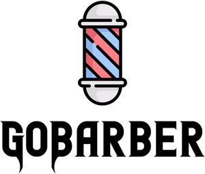

<p align="center">
  
</p>

<br>

# 💈 A Barber application for Clients and Hairstylists

### 🛠 Develop with TypeScript and ExpressJs

- 📏 ESLint — JavaScript linter
- 💖 Prettier - Code Formatter
- 🐶 Husky — For use git hooks with ease
- 📄 Commitizen - Conventional commit messages CLI
- 🚓 Commitlint - Lint commit messages
- 🚫 lint-staged - Run linters against staged git files

# 🚀 Getting started

[ ... ]

If you prefer you can clone this repository and run the following commands inside the project folder:

```sh
  yarn;
  yarn dev:server;
```

🚀 Server started on port 3333 => http://localhost:3333

# 🛣 Routes

This application use system routes separated located in `./src/routes` using pattern name `groupName.routes.ts`

# 🤝 Contributing

1. Fork this repository;
2. Create your branch: `git checkout -b my-new-feature`;
3. Commit your changes: `git commit -m 'add a feature'`;
4. Push to the branch: `git push origin my-new-feature`.

**After your pull request is merged**, you can safely delete your branch.

## 📝 License

This project is licensed under the MIT License - see the [LICENSE.md](LICENSE.md) file for more information.

---

Made with ♥ by [louzada01](https://github.com/louzada01)
